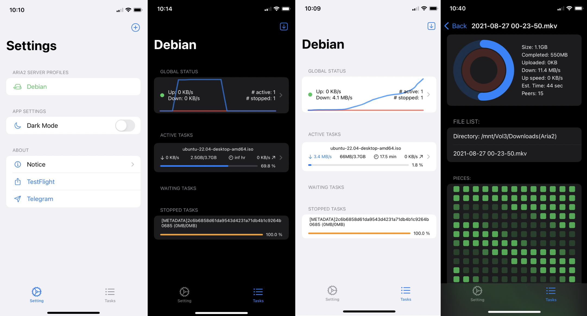
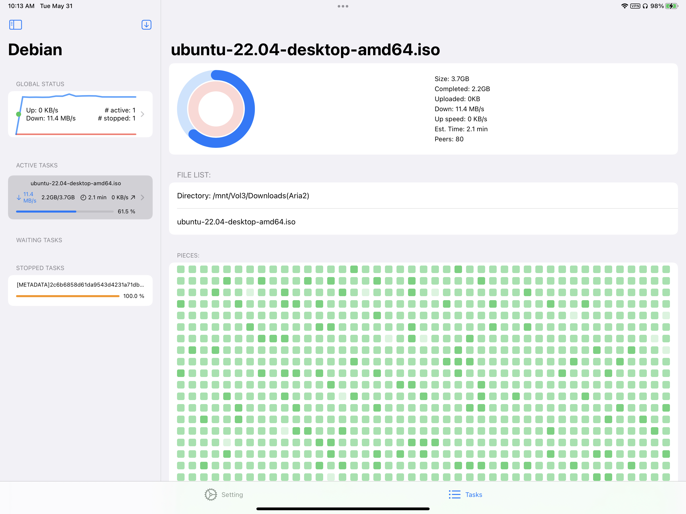

# Aria2-SwiftUI

## An Aria2 Client Powered by SwiftUI
Demo preview on YouTube [todo]
Currently, the source code is too messy to be public [to do]

### iOS: iPhone, iPad, Mac

### Mac menubar tool
Mac menubar tool [to do]

## Features: 
- [x] Native SwiftUI
- [ ] MacOS menubar (notification for tasks completed, added); hide detail
- [x] accept link with URL Scheme (nomad)
- [x] qBittorrent (to improve)
- [ ] iCloud sync
- [ ] Font (Monaco), APP lock
- [ ] sort, search
- [ ] iOS Widget
- [ ] SSL (to test)
<!-- - [ ] Notification  -->
<!-- - [ ] Design logo -->

### Todo features
- [ ] multi connections; card (grid) view
- [ ] notification (background) on iOS ?
- [ ] iOS widget, watchOS?, tvOS?
- [ ] uTorrent?, Transmission?

<!-- ## Mac: Catalyt -->

<!-- ## Apple Watch -->

<!-- ## Apple TV -->

## Usage and Contact
TestFlight: https://testflight.apple.com/join/0IKi3DNF

Telegram: https://t.me/+vtlADdgU3kcyZTNl

ipa (to release)

## Test downloadable Links

https://ubuntu.com/download/desktop/thank-you?version=22.04&architecture=amd64

magnet:?xt=urn:btih:2C6B6858D61DA9543D4231A71DB4B1C9264B0685

## Credits 
https://github.com/AlanLang/BitClient
https://github.com/edualm/SeedTruck